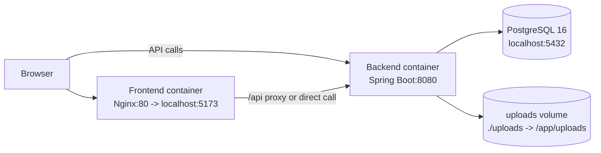
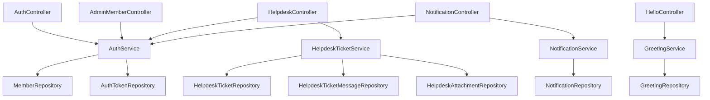
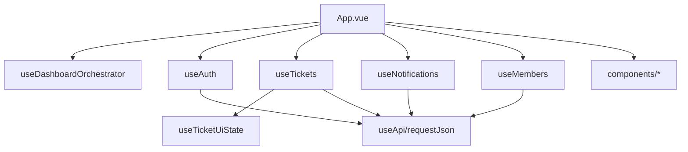

# Current File & System Architecture

Snapshot: commit `07c8f0c`

## 1) Repository File Structure (trimmed)

```text
fullstack/
├─ docker-compose.yml
├─ .env
├─ README.md
├─ uploads/
├─ docs/
│  └─ CURRENT_ARCHITECTURE.md
├─ backend/
│  ├─ pom.xml
│  └─ src/
│     ├─ main/
│     │  ├─ java/com/example/demo/
│     │  │  ├─ DemoApplication.java
│     │  │  ├─ HelloController.java
│     │  │  ├─ greeting/
│     │  │  │  ├─ Greeting.java
│     │  │  │  ├─ GreetingRepository.java
│     │  │  │  ├─ GreetingService.java
│     │  │  │  └─ GreetingInitializer.java
│     │  │  ├─ auth/
│     │  │  │  ├─ AuthController.java
│     │  │  │  ├─ AdminMemberController.java
│     │  │  │  ├─ AuthService.java
│     │  │  │  ├─ AuthInitializer.java
│     │  │  │  ├─ AuthSchemaPatch.java
│     │  │  │  ├─ Member.java
│     │  │  │  ├─ MemberRole.java
│     │  │  │  ├─ MemberRepository.java
│     │  │  │  ├─ AuthToken.java
│     │  │  │  └─ AuthTokenRepository.java
│     │  │  ├─ helpdesk/
│     │  │  │  ├─ HelpdeskController.java
│     │  │  │  ├─ HelpdeskTicketService.java
│     │  │  │  ├─ HelpdeskExceptionHandler.java
│     │  │  │  ├─ HelpdeskSchemaPatch.java
│     │  │  │  ├─ HelpdeskTicket.java
│     │  │  │  ├─ HelpdeskTicketStatus.java
│     │  │  │  ├─ HelpdeskTicketRepository.java
│     │  │  │  ├─ HelpdeskTicketMessage.java
│     │  │  │  ├─ HelpdeskTicketMessageRepository.java
│     │  │  │  ├─ HelpdeskAttachment.java
│     │  │  │  └─ HelpdeskAttachmentRepository.java
│     │  │  └─ notification/
│     │  │     ├─ NotificationController.java
│     │  │     ├─ NotificationService.java
│     │  │     ├─ Notification.java
│     │  │     ├─ NotificationType.java
│     │  │     └─ NotificationRepository.java
│     │  └─ resources/
│     │     └─ application.properties
│     └─ test/
└─ frontend/
   ├─ package.json
   ├─ tsconfig.json
   └─ src/
      ├─ main.ts
      ├─ App.vue
      ├─ types.ts
      ├─ styles/app.css
      ├─ components/
      │  ├─ AuthPanel.vue
      │  ├─ AppHeader.vue
      │  ├─ NotificationPanel.vue
      │  ├─ TicketFormPanel.vue
      │  ├─ TicketListPanel.vue
      │  └─ MembersPanel.vue
      └─ composables/
         ├─ useApi.ts
         ├─ useAuth.ts
         ├─ useDashboardOrchestrator.ts
         ├─ useMembers.ts
         ├─ useNotifications.ts
         ├─ useTicketUiState.ts
         └─ useTickets.ts
```

## 2) Runtime System Architecture

### 2.1 Container / Network View



Source: `docker-compose.yml`

### 2.2 Backend Layer View



### 2.3 Frontend Module View



## 3) Main API Surface

- Auth
  - `POST /api/auth/register`
  - `POST /api/auth/login`
  - `GET /api/auth/me`
  - `POST /api/auth/logout`
- Admin
  - `GET /api/admin/members`
  - `PATCH /api/admin/members/{id}/role`
  - `DELETE /api/admin/members/{id}`
- Helpdesk
  - `POST /api/helpdesk/tickets` (multipart, attachments)
  - `GET /api/helpdesk/tickets`
  - `POST /api/helpdesk/tickets/{id}/messages`
  - `PATCH /api/helpdesk/tickets/{id}/status`
  - `PATCH /api/helpdesk/tickets/{id}/delete`
  - `GET /api/helpdesk/tickets/{ticketId}/attachments/{attachmentId}/view`
  - `GET /api/helpdesk/tickets/{ticketId}/attachments/{attachmentId}/download`
- Notifications
  - `GET /api/notifications`
  - `PATCH /api/notifications/{id}/read`
  - `PATCH /api/notifications/read-all`
- Misc
  - `GET /api/hello`

## 4) Key Data Domains

- Auth domain
  - `Member` (role: `ADMIN` / `IT` / `USER`)
  - `AuthToken` (session token)
- Helpdesk domain
  - `HelpdeskTicket`
  - `HelpdeskTicketMessage`
  - `HelpdeskAttachment` (metadata in DB, file in uploads dir)
- Notification domain
  - `Notification` (linked ticketId, unread/read)

## 5) Configuration / Operational Notes

- Backend config: `backend/src/main/resources/application.properties`
  - DB via `SPRING_DATASOURCE_*`
  - Upload path via `HELPDESK_UPLOAD_DIR`
  - Bootstrap admin via `APP_ADMIN_*`
- Frontend build
  - `tsconfig.json` uses `noEmit: true`
  - source-of-truth is TypeScript/Vue files only (no generated `src/*.js` committed)
